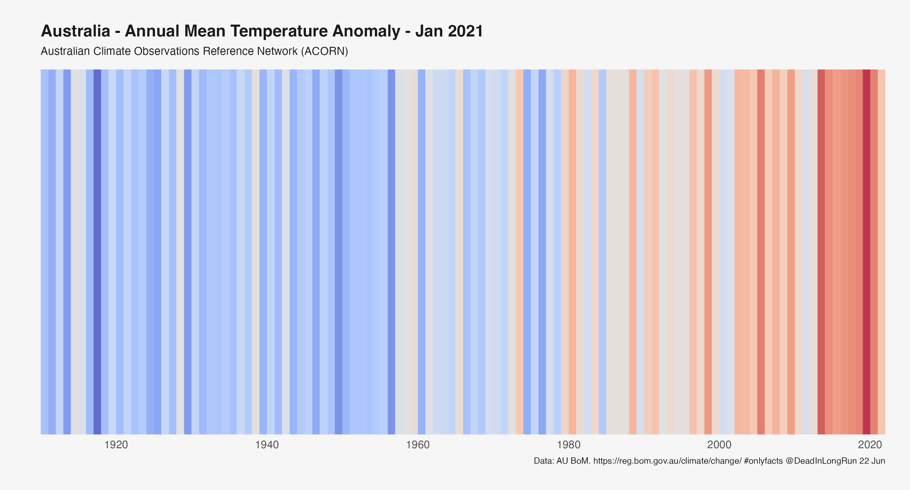
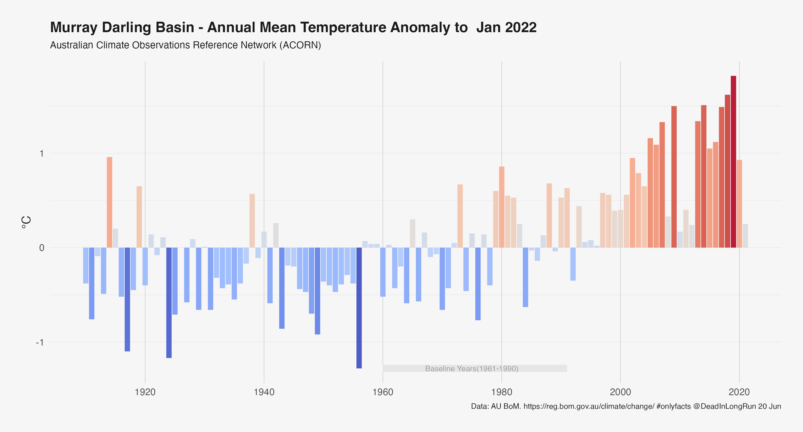
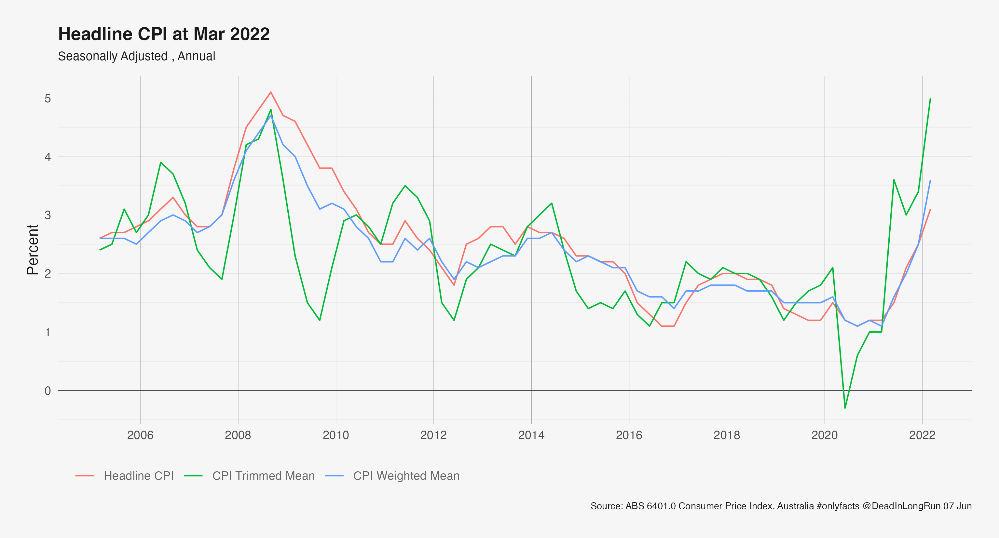

# OnlyFactsAU

A fact tank. Not a think tank.

# Health

## Latest Deaths

# Energy

## Electricity 2021 Demand and Price

-Year.png)

## Electricity Black Coal Brown Coal Generators Forward Capacity

# Climate

## Australia Annual Mean Temperature Stripes

## Australia Murray Darling Basis Average Mean Temperature

## Great Barrier Reef - Sea Surface Temperatures

## Gape Grim - Carbon Dioxide Concentrations

# Economy

## Headline CPI Changes

