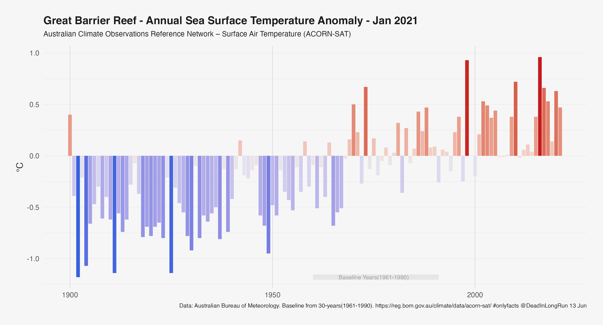
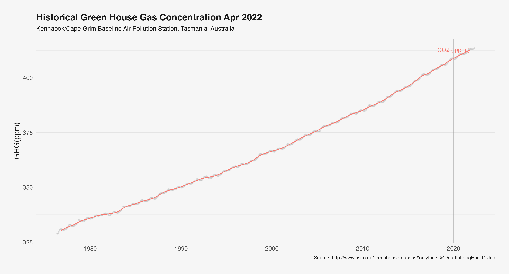

# OnlyFacts.AU

A fact tank. Not a think tank.

# Health

## Latest COVID Deaths

| Greater Sydney                                                                            | Regional NSW                                                                                        |
|-------------------------------------------------------------------------------------------|-----------------------------------------------------------------------------------------------------|
|  |  |

## Cases per Population

# Energy

## Electricity 2021 Demand and Price

[-Year.png)](Outputs/2021-01-01-NEM-MM-Prices-NuclearNational Electricity Market(NEM)-Year.png)

## National Energy Market Generators Forward Capacity

| Black and Brown Coal                                                                                                          | Gas                                                                                                                                     | Hydro                                                                                     |
|-------------------------------------------------------------------------------------------------------------------------------|-----------------------------------------------------------------------------------------------------------------------------------------|-------------------------------------------------------------------------------------------|
|  |  |  |

# Climate

## Australia Annual Mean Temperature Stripes

## Australia Murray Darling Basis Average Mean Temperature

## Great Barrier Reef - Sea Surface Temperatures

## Gape Grim - Carbon Dioxide Concentrations

# Economy

## Headline CPI Changes

